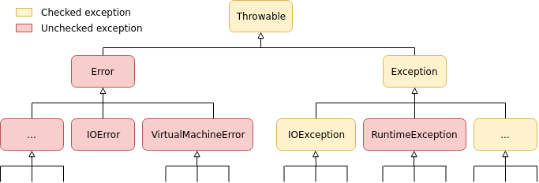

To fully understand Java exception I believe it's useful to make a trip in memory lane and undertand how exceptions are handled in languages that predate Java. In **C** for instance it was used return types to indicate errors. So you would have something like:

```c
#include <stdlib.h>

int main(void) {
    // do something
    if (error_occurred) {
        return -1; // failure
    }
    return 0; // success
}
```

Where 0 means your code executed successfully and any non-zero value meant otherwise. But what if your function can have multiple errors? It could fail because a file was not found, the connection to the database was refused or there was no size left in the disk while you where writing in it! The solution was to return different integer values: 0 would mean success, 1 an error in database, 2 an IO problem. These values were never standardized and it was hard to track every possible error, specially in larger projects. In one part of the code a 1 could mean something, while in other it would have another meaning. I don't code in C anymore and I have no idea if there are well-estabilished better practices today, so let's move to Java that is my domain.

The designers of the Java language wanted something more robust, that when something goes wrong it can be handled as the program is running. They wanted to force developers to aknowledge that the code they're writing could not behave as expected and deal with it approperly in case. They also wanted to be easy to understand what exactly went wrong with a more descriptive information then a return value of an **8** which could mean anything. So they came up with an error/exception handling system.

<hr />

An exception will happen if something wrong happens during the execution of the program, instead of executing the next line of code it will jump to a designed section that will properly handle such exception.

```java
public File writeHelloWorld(String fileName, String content) {
    File file = new File(fileName);
    OutputStream outputStream = new FileOutputStream(file); // error if the file is not found
    outputStream.write(content.getBytes(), 0, content.length()); // could also cause an error if disk is not responding, it's full or other reasons
    return file;
}
```

The code above won't even compile because we haven't said anything on how these two exceptions should be handled. One way to handle it is by _catching_ this exception and display a message to the user or do something else. In order to that it's used a `try/catch` block:

```java
public File writeHelloWorld(String fileName, String content) {
    try {
        File file = new File(fileName);
        OutputStream outputStream = new FileOutputStream(file);
        outputStream.write(content, 0, content.length());
        return File;
    } catch (FileNotFoundException e) {
        // handle the case if the file is not found
    } catch (IOException e) {
        // handle the case if it failed to write
    }
}
```

What happens here is that if any line in the try block has an error of the type `FileNotFoundException` then it will skip all the other lines and will execute the code inside that specific catch block. The same will happen with the `IOException`. Much better than controlling all possible exceptions using an integer values, huh? In these block you can write any code, it's no different than the try block, **best practices will depends a lot on how the application is designed.**

<hr />

# Checked and Unchecked Exceptions

### Checked Exceptions

The previous exceptions are of this type. They represent errors that the program can recover. It's mandatory to handle checked exceptions either by:

- Catching and handling them
- Re-throwing them, which will force methods higher up in the call trace to handle them

If you don't handle them the compiler will complain about it and won't compile your code.

### Unchecked Exceptions

Are errors internal to the application and the application cannot recover from them, these can be due some logic error (division by zero, trying to access an index that doesn't exist in the array, etc) or some extreme abnormal situation like a problem in the Virtual Machine or the disk completely failing. You're not required to declare them in the code, althought it's possible to catch them.

# Class Hierarchy

All exceptions descends from `java.lang.Throwable`, but it has only immediate two childs: **Error** and **Exception**.

`Error` are **unchecked exceptions**, more spefically those errors in extreme abnormal situations, they are quite rare and not much can be done when they happen. Just try to log it and gracefully exit the program.

`Exception` is a **checked exceptions** as well as its subclasses. There is one exception: `RuntimeException` is an **unchecked exception**. As a rule if you get a `RuntimeException` error it is your fault since this could have been avoided but making a null check, checking the size of the array before accessing it, etc.



# To be continued...
