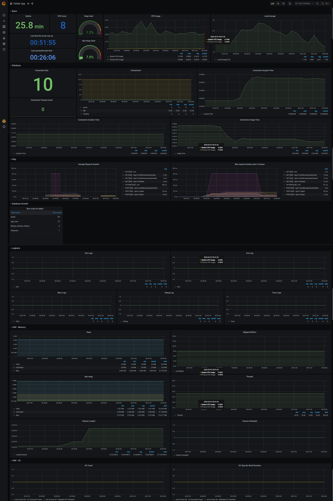

Spring Boot has the [Spring Boot Actuator](https://docs.spring.io/spring-boot/docs/current/reference/html/production-ready-features.html), which allows for easy monitoring by providing endpoints with monitoring data. These endpoints can be HTTP or JMX (Java Management Extensions).

By using Prometheus it's possible to monitor these endpoints from time to time and have this data in a time series format. On Grafana dashboards can be created using this data to monitor in real time.

I analyzed the default data provided by Spring Boot Actuator and created this dashboard that uses them.



The dashboard in JSON format ready for importing:

```json
{
  "annotations": {
    "list": [
      {
        "builtIn": 1,
        "datasource": "-- Grafana --",
        "enable": true,
        "hide": true,
        "iconColor": "rgba(0, 211, 255, 1)",
        "name": "Annotations & Alerts",
        "type": "dashboard"
      }
    ]
  },
  "editable": true,
  "gnetId": null,
  "graphTooltip": 0,
  "id": 2,
  "links": [],
  "panels": [
    {
      "collapsed": false,
      "datasource": null,
      "gridPos": {
        "h": 1,
        "w": 24,
        "x": 0,
        "y": 0
      },
      "id": 20,
      "panels": [],
      "title": "Basic",
      "type": "row"
    },
    {
      "datasource": "Twitter Spring Boot",
      "description": "",
      "fieldConfig": {
        "defaults": {
          "custom": {},
          "mappings": [
            {
              "from": "",
              "id": 0,
              "text": "DOWN",
              "to": "",
              "type": 1,
              "value": "null"
            }
          ],
          "thresholds": {
            "mode": "absolute",
            "steps": [
              {
                "color": "dark-red",
                "value": null
              },
              {
                "color": "yellow",
                "value": 5
              },
              {
                "color": "green",
                "value": 60
              }
            ]
          },
          "unit": "s"
        },
        "overrides": []
      },
      "gridPos": {
        "h": 4,
        "w": 3,
        "x": 0,
        "y": 1
      },
      "id": 2,
      "options": {
        "colorMode": "value",
        "graphMode": "none",
        "justifyMode": "center",
        "orientation": "auto",
        "reduceOptions": {
          "calcs": ["last"],
          "fields": "",
          "values": false
        },
        "textMode": "auto"
      },
      "pluginVersion": "7.1.5",
      "targets": [
        {
          "expr": "process_uptime_seconds",
          "format": "heatmap",
          "instant": false,
          "interval": "",
          "intervalFactor": 2,
          "legendFormat": "",
          "refId": "A"
        }
      ],
      "timeFrom": null,
      "timeShift": null,
      "title": "Uptime",
      "type": "stat"
    },
    {
      "datasource": null,
      "fieldConfig": {
        "defaults": {
          "custom": {},
          "mappings": [
            {
              "from": "",
              "id": 0,
              "text": "N/A",
              "to": "",
              "type": 1,
              "value": "null"
            }
          ],
          "thresholds": {
            "mode": "absolute",
            "steps": [
              {
                "color": "dark-blue",
                "value": null
              }
            ]
          }
        },
        "overrides": []
      },
      "gridPos": {
        "h": 4,
        "w": 2,
        "x": 3,
        "y": 1
      },
      "id": 16,
      "options": {
        "colorMode": "value",
        "graphMode": "none",
        "justifyMode": "auto",
        "orientation": "auto",
        "reduceOptions": {
          "calcs": ["lastNotNull"],
          "fields": "",
          "values": false
        },
        "textMode": "auto"
      },
      "pluginVersion": "7.1.5",
      "targets": [
        {
          "expr": "system_cpu_count",
          "interval": "",
          "legendFormat": "",
          "refId": "A"
        }
      ],
      "timeFrom": null,
      "timeShift": null,
      "title": "CPU Cores",
      "type": "stat"
    },
    {
      "datasource": "Twitter Spring Boot",
      "fieldConfig": {
        "defaults": {
          "custom": {},
          "mappings": [
            {
              "from": "",
              "id": 0,
              "text": "N/A",
              "to": "",
              "type": 1,
              "value": "null"
            }
          ],
          "thresholds": {
            "mode": "absolute",
            "steps": [
              {
                "color": "dark-green",
                "value": null
              },
              {
                "color": "orange",
                "value": 70
              },
              {
                "color": "dark-red",
                "value": 90
              }
            ]
          },
          "unit": "percent"
        },
        "overrides": []
      },
      "gridPos": {
        "h": 5,
        "w": 2,
        "x": 5,
        "y": 1
      },
      "id": 6,
      "options": {
        "reduceOptions": {
          "calcs": ["lastNotNull"],
          "fields": "",
          "values": false
        },
        "showThresholdLabels": false,
        "showThresholdMarkers": true
      },
      "pluginVersion": "7.1.5",
      "targets": [
        {
          "expr": "sum(jvm_memory_used_bytes{area=\"heap\"})*100/sum(jvm_memory_max_bytes{area=\"heap\"})",
          "interval": "",
          "legendFormat": "",
          "refId": "A"
        }
      ],
      "timeFrom": null,
      "timeShift": null,
      "title": "Heap Used",
      "type": "gauge"
    },
    {
      "aliasColors": {},
      "bars": false,
      "dashLength": 10,
      "dashes": false,
      "datasource": null,
      "fieldConfig": {
        "defaults": {
          "custom": {}
        },
        "overrides": []
      },
      "fill": 1,
      "fillGradient": 0,
      "gridPos": {
        "h": 10,
        "w": 8,
        "x": 7,
        "y": 1
      },
      "hiddenSeries": false,
      "id": 10,
      "legend": {
        "alignAsTable": true,
        "avg": true,
        "current": true,
        "max": true,
        "min": true,
        "show": true,
        "total": false,
        "values": true
      },
      "lines": true,
      "linewidth": 1,
      "nullPointMode": "null",
      "percentage": false,
      "pluginVersion": "7.1.5",
      "pointradius": 2,
      "points": false,
      "renderer": "flot",
      "seriesOverrides": [],
      "spaceLength": 10,
      "stack": false,
      "steppedLine": false,
      "targets": [
        {
          "expr": "system_cpu_usage",
          "interval": "",
          "legendFormat": "System CPU Usage",
          "refId": "A"
        },
        {
          "expr": "process_cpu_usage",
          "interval": "",
          "legendFormat": "Process CPU Usage",
          "refId": "B"
        }
      ],
      "thresholds": [],
      "timeFrom": null,
      "timeRegions": [],
      "timeShift": null,
      "title": "CPU Usage",
      "tooltip": {
        "shared": true,
        "sort": 0,
        "value_type": "individual"
      },
      "type": "graph",
      "xaxis": {
        "buckets": null,
        "mode": "time",
        "name": null,
        "show": true,
        "values": []
      },
      "yaxes": [
        {
          "format": "short",
          "label": null,
          "logBase": 1,
          "max": null,
          "min": null,
          "show": true
        },
        {
          "format": "short",
          "label": null,
          "logBase": 1,
          "max": null,
          "min": null,
          "show": true
        }
      ],
      "yaxis": {
        "align": false,
        "alignLevel": null
      }
    },
    {
      "aliasColors": {},
      "bars": false,
      "dashLength": 10,
      "dashes": false,
      "datasource": null,
      "fieldConfig": {
        "defaults": {
          "custom": {}
        },
        "overrides": []
      },
      "fill": 1,
      "fillGradient": 0,
      "gridPos": {
        "h": 10,
        "w": 9,
        "x": 15,
        "y": 1
      },
      "hiddenSeries": false,
      "id": 12,
      "legend": {
        "alignAsTable": true,
        "avg": true,
        "current": true,
        "max": true,
        "min": true,
        "show": true,
        "total": false,
        "values": true
      },
      "lines": true,
      "linewidth": 1,
      "nullPointMode": "null",
      "percentage": false,
      "pluginVersion": "7.1.5",
      "pointradius": 2,
      "points": false,
      "renderer": "flot",
      "seriesOverrides": [],
      "spaceLength": 10,
      "stack": false,
      "steppedLine": false,
      "targets": [
        {
          "expr": "system_load_average_1m",
          "interval": "",
          "legendFormat": "Load Average [1m]",
          "refId": "A"
        }
      ],
      "thresholds": [],
      "timeFrom": null,
      "timeRegions": [],
      "timeShift": null,
      "title": "Load Average",
      "tooltip": {
        "shared": true,
        "sort": 0,
        "value_type": "individual"
      },
      "type": "graph",
      "xaxis": {
        "buckets": null,
        "mode": "time",
        "name": null,
        "show": true,
        "values": []
      },
      "yaxes": [
        {
          "format": "short",
          "label": null,
          "logBase": 1,
          "max": null,
          "min": null,
          "show": true
        },
        {
          "format": "short",
          "label": null,
          "logBase": 1,
          "max": null,
          "min": null,
          "show": true
        }
      ],
      "yaxis": {
        "align": false,
        "alignLevel": null
      }
    },
    {
      "datasource": null,
      "fieldConfig": {
        "defaults": {
          "custom": {},
          "mappings": [
            {
              "from": "",
              "id": 0,
              "text": "N/A",
              "to": "",
              "type": 1,
              "value": "null"
            }
          ],
          "thresholds": {
            "mode": "absolute",
            "steps": [
              {
                "color": "dark-blue",
                "value": null
              }
            ]
          },
          "unit": "dateTimeAsIso"
        },
        "overrides": []
      },
      "gridPos": {
        "h": 3,
        "w": 5,
        "x": 0,
        "y": 5
      },
      "id": 18,
      "options": {
        "colorMode": "value",
        "graphMode": "none",
        "justifyMode": "auto",
        "orientation": "auto",
        "reduceOptions": {
          "calcs": ["lastNotNull"],
          "fields": "",
          "values": false
        },
        "textMode": "auto"
      },
      "pluginVersion": "7.1.5",
      "targets": [
        {
          "expr": "(process_uptime_seconds + process_start_time_seconds) * 1000",
          "interval": "",
          "legendFormat": "",
          "refId": "A"
        }
      ],
      "timeFrom": null,
      "timeShift": null,
      "title": "Last time the server was up",
      "type": "stat"
    },
    {
      "datasource": null,
      "fieldConfig": {
        "defaults": {
          "custom": {},
          "mappings": [
            {
              "from": "",
              "id": 0,
              "text": "N/A",
              "to": "",
              "type": 1,
              "value": "null"
            }
          ],
          "thresholds": {
            "mode": "absolute",
            "steps": [
              {
                "color": "green",
                "value": null
              },
              {
                "color": "dark-orange",
                "value": 70
              },
              {
                "color": "dark-red",
                "value": 90
              }
            ]
          },
          "unit": "percent"
        },
        "overrides": []
      },
      "gridPos": {
        "h": 5,
        "w": 2,
        "x": 5,
        "y": 6
      },
      "id": 8,
      "options": {
        "reduceOptions": {
          "calcs": ["lastNotNull"],
          "fields": "",
          "values": false
        },
        "showThresholdLabels": false,
        "showThresholdMarkers": true
      },
      "pluginVersion": "7.1.5",
      "targets": [
        {
          "expr": "sum(jvm_memory_used_bytes{area=\"nonheap\"})*100/sum(jvm_memory_max_bytes{area=\"nonheap\"})",
          "interval": "",
          "legendFormat": "",
          "refId": "A"
        }
      ],
      "timeFrom": null,
      "timeShift": null,
      "title": "Non-Heap Used",
      "type": "gauge"
    },
    {
      "datasource": "Twitter Spring Boot",
      "description": "",
      "fieldConfig": {
        "defaults": {
          "custom": {},
          "mappings": [
            {
              "from": "",
              "id": 0,
              "text": "N/A",
              "to": "",
              "type": 1,
              "value": "null"
            }
          ],
          "thresholds": {
            "mode": "absolute",
            "steps": [
              {
                "color": "blue",
                "value": null
              }
            ]
          },
          "unit": "dateTimeAsIso"
        },
        "overrides": []
      },
      "gridPos": {
        "h": 3,
        "w": 5,
        "x": 0,
        "y": 8
      },
      "id": 4,
      "options": {
        "colorMode": "value",
        "graphMode": "none",
        "justifyMode": "auto",
        "orientation": "auto",
        "reduceOptions": {
          "calcs": ["lastNotNull"],
          "fields": "",
          "values": false
        },
        "textMode": "auto"
      },
      "pluginVersion": "7.1.5",
      "targets": [
        {
          "expr": "process_start_time_seconds*1000",
          "interval": "",
          "legendFormat": "",
          "refId": "A"
        }
      ],
      "timeFrom": null,
      "timeShift": null,
      "title": "Last successful start time",
      "type": "stat"
    },
    {
      "collapsed": false,
      "datasource": null,
      "gridPos": {
        "h": 1,
        "w": 24,
        "x": 0,
        "y": 11
      },
      "id": 22,
      "panels": [],
      "title": "Database",
      "type": "row"
    },
    {
      "datasource": null,
      "fieldConfig": {
        "defaults": {
          "custom": {},
          "mappings": [
            {
              "from": "",
              "id": 0,
              "text": "N/A",
              "to": "",
              "type": 1,
              "value": "null"
            }
          ],
          "thresholds": {
            "mode": "absolute",
            "steps": [
              {
                "color": "green",
                "value": null
              },
              {
                "color": "red",
                "value": 80
              }
            ]
          }
        },
        "overrides": []
      },
      "gridPos": {
        "h": 6,
        "w": 5,
        "x": 0,
        "y": 12
      },
      "id": 24,
      "options": {
        "colorMode": "value",
        "graphMode": "none",
        "justifyMode": "center",
        "orientation": "auto",
        "reduceOptions": {
          "calcs": ["lastNotNull"],
          "fields": "",
          "values": false
        },
        "textMode": "auto"
      },
      "pluginVersion": "7.1.5",
      "targets": [
        {
          "expr": "hikaricp_connections",
          "interval": "",
          "legendFormat": "{{pool}}",
          "refId": "A"
        }
      ],
      "timeFrom": null,
      "timeShift": null,
      "title": "Connection Size",
      "type": "stat"
    },
    {
      "aliasColors": {},
      "bars": false,
      "dashLength": 10,
      "dashes": false,
      "datasource": null,
      "fieldConfig": {
        "defaults": {
          "custom": {}
        },
        "overrides": []
      },
      "fill": 1,
      "fillGradient": 0,
      "gridPos": {
        "h": 10,
        "w": 9,
        "x": 5,
        "y": 12
      },
      "hiddenSeries": false,
      "id": 28,
      "legend": {
        "alignAsTable": true,
        "avg": true,
        "current": true,
        "max": true,
        "min": true,
        "show": true,
        "total": false,
        "values": true
      },
      "lines": true,
      "linewidth": 1,
      "nullPointMode": "null",
      "percentage": false,
      "pluginVersion": "7.1.5",
      "pointradius": 2,
      "points": false,
      "renderer": "flot",
      "seriesOverrides": [],
      "spaceLength": 10,
      "stack": false,
      "steppedLine": false,
      "targets": [
        {
          "expr": "hikaricp_connections_active",
          "interval": "",
          "legendFormat": "Active",
          "refId": "A"
        },
        {
          "expr": "hikaricp_connections_idle",
          "interval": "",
          "legendFormat": "Idle",
          "refId": "B"
        },
        {
          "expr": "hikaricp_connections_pending",
          "interval": "",
          "legendFormat": "Pending",
          "refId": "C"
        }
      ],
      "thresholds": [],
      "timeFrom": null,
      "timeRegions": [],
      "timeShift": null,
      "title": "Connections",
      "tooltip": {
        "shared": true,
        "sort": 0,
        "value_type": "individual"
      },
      "type": "graph",
      "xaxis": {
        "buckets": null,
        "mode": "time",
        "name": null,
        "show": true,
        "values": []
      },
      "yaxes": [
        {
          "format": "short",
          "label": null,
          "logBase": 1,
          "max": null,
          "min": null,
          "show": true
        },
        {
          "format": "short",
          "label": null,
          "logBase": 1,
          "max": null,
          "min": null,
          "show": true
        }
      ],
      "yaxis": {
        "align": false,
        "alignLevel": null
      }
    },
    {
      "aliasColors": {},
      "bars": false,
      "dashLength": 10,
      "dashes": false,
      "datasource": null,
      "fieldConfig": {
        "defaults": {
          "custom": {}
        },
        "overrides": []
      },
      "fill": 1,
      "fillGradient": 0,
      "gridPos": {
        "h": 10,
        "w": 10,
        "x": 14,
        "y": 12
      },
      "hiddenSeries": false,
      "id": 34,
      "legend": {
        "alignAsTable": true,
        "avg": true,
        "current": true,
        "max": true,
        "min": true,
        "show": true,
        "total": false,
        "values": true
      },
      "lines": true,
      "linewidth": 1,
      "nullPointMode": "null",
      "percentage": false,
      "pluginVersion": "7.1.5",
      "pointradius": 2,
      "points": false,
      "renderer": "flot",
      "seriesOverrides": [],
      "spaceLength": 10,
      "stack": false,
      "steppedLine": false,
      "targets": [
        {
          "expr": "hikaricp_connections_acquire_seconds_sum / hikaricp_connections_acquire_seconds_count",
          "interval": "",
          "legendFormat": "Acquire Time",
          "refId": "A"
        }
      ],
      "thresholds": [],
      "timeFrom": null,
      "timeRegions": [],
      "timeShift": null,
      "title": "Connection Acquire Time",
      "tooltip": {
        "shared": true,
        "sort": 0,
        "value_type": "individual"
      },
      "type": "graph",
      "xaxis": {
        "buckets": null,
        "mode": "time",
        "name": null,
        "show": true,
        "values": []
      },
      "yaxes": [
        {
          "format": "short",
          "label": null,
          "logBase": 1,
          "max": null,
          "min": null,
          "show": true
        },
        {
          "format": "short",
          "label": null,
          "logBase": 1,
          "max": null,
          "min": null,
          "show": true
        }
      ],
      "yaxis": {
        "align": false,
        "alignLevel": null
      }
    },
    {
      "datasource": null,
      "fieldConfig": {
        "defaults": {
          "custom": {},
          "mappings": [
            {
              "from": "",
              "id": 0,
              "text": "N/A",
              "to": "",
              "type": 1,
              "value": "null"
            }
          ],
          "thresholds": {
            "mode": "absolute",
            "steps": [
              {
                "color": "green",
                "value": null
              },
              {
                "color": "red",
                "value": 80
              }
            ]
          }
        },
        "overrides": []
      },
      "gridPos": {
        "h": 4,
        "w": 5,
        "x": 0,
        "y": 18
      },
      "id": 26,
      "options": {
        "colorMode": "value",
        "graphMode": "area",
        "justifyMode": "center",
        "orientation": "auto",
        "reduceOptions": {
          "calcs": ["lastNotNull"],
          "fields": "",
          "values": false
        },
        "textMode": "auto"
      },
      "pluginVersion": "7.1.5",
      "targets": [
        {
          "expr": "hikaricp_connections_timeout_total",
          "interval": "",
          "legendFormat": "{{pool}}",
          "refId": "A"
        }
      ],
      "timeFrom": null,
      "timeShift": null,
      "title": "Connection Timeout Count",
      "type": "stat"
    },
    {
      "aliasColors": {},
      "bars": false,
      "dashLength": 10,
      "dashes": false,
      "datasource": null,
      "fieldConfig": {
        "defaults": {
          "custom": {}
        },
        "overrides": []
      },
      "fill": 1,
      "fillGradient": 0,
      "gridPos": {
        "h": 8,
        "w": 12,
        "x": 0,
        "y": 22
      },
      "hiddenSeries": false,
      "id": 30,
      "legend": {
        "alignAsTable": true,
        "avg": true,
        "current": true,
        "max": true,
        "min": true,
        "show": true,
        "total": false,
        "values": true
      },
      "lines": true,
      "linewidth": 1,
      "nullPointMode": "null",
      "percentage": false,
      "pluginVersion": "7.1.5",
      "pointradius": 2,
      "points": false,
      "renderer": "flot",
      "seriesOverrides": [],
      "spaceLength": 10,
      "stack": false,
      "steppedLine": false,
      "targets": [
        {
          "expr": "hikaricp_connections_creation_seconds_sum / hikaricp_connections_creation_seconds_count",
          "interval": "",
          "legendFormat": "Creation Time",
          "refId": "A"
        }
      ],
      "thresholds": [],
      "timeFrom": null,
      "timeRegions": [],
      "timeShift": null,
      "title": "Connection Creation Time",
      "tooltip": {
        "shared": true,
        "sort": 0,
        "value_type": "individual"
      },
      "type": "graph",
      "xaxis": {
        "buckets": null,
        "mode": "time",
        "name": null,
        "show": true,
        "values": []
      },
      "yaxes": [
        {
          "format": "short",
          "label": null,
          "logBase": 1,
          "max": null,
          "min": null,
          "show": true
        },
        {
          "format": "short",
          "label": null,
          "logBase": 1,
          "max": null,
          "min": null,
          "show": true
        }
      ],
      "yaxis": {
        "align": false,
        "alignLevel": null
      }
    },
    {
      "aliasColors": {},
      "bars": false,
      "dashLength": 10,
      "dashes": false,
      "datasource": null,
      "fieldConfig": {
        "defaults": {
          "custom": {}
        },
        "overrides": []
      },
      "fill": 1,
      "fillGradient": 0,
      "gridPos": {
        "h": 8,
        "w": 12,
        "x": 12,
        "y": 22
      },
      "hiddenSeries": false,
      "id": 32,
      "legend": {
        "alignAsTable": true,
        "avg": true,
        "current": true,
        "max": true,
        "min": true,
        "show": true,
        "total": false,
        "values": true
      },
      "lines": true,
      "linewidth": 1,
      "nullPointMode": "null",
      "percentage": false,
      "pluginVersion": "7.1.5",
      "pointradius": 2,
      "points": false,
      "renderer": "flot",
      "seriesOverrides": [],
      "spaceLength": 10,
      "stack": false,
      "steppedLine": false,
      "targets": [
        {
          "expr": "hikaricp_connections_usage_seconds_sum / hikaricp_connections_usage_seconds_count",
          "interval": "",
          "legendFormat": "Usage Time",
          "refId": "A"
        }
      ],
      "thresholds": [],
      "timeFrom": null,
      "timeRegions": [],
      "timeShift": null,
      "title": "Connection Usage Time",
      "tooltip": {
        "shared": true,
        "sort": 0,
        "value_type": "individual"
      },
      "type": "graph",
      "xaxis": {
        "buckets": null,
        "mode": "time",
        "name": null,
        "show": true,
        "values": []
      },
      "yaxes": [
        {
          "format": "short",
          "label": null,
          "logBase": 1,
          "max": null,
          "min": null,
          "show": true
        },
        {
          "format": "short",
          "label": null,
          "logBase": 1,
          "max": null,
          "min": null,
          "show": true
        }
      ],
      "yaxis": {
        "align": false,
        "alignLevel": null
      }
    },
    {
      "collapsed": false,
      "datasource": null,
      "gridPos": {
        "h": 1,
        "w": 24,
        "x": 0,
        "y": 30
      },
      "id": 36,
      "panels": [],
      "title": "Http",
      "type": "row"
    },
    {
      "aliasColors": {},
      "bars": false,
      "dashLength": 10,
      "dashes": false,
      "datasource": null,
      "fieldConfig": {
        "defaults": {
          "custom": {}
        },
        "overrides": []
      },
      "fill": 1,
      "fillGradient": 0,
      "gridPos": {
        "h": 8,
        "w": 12,
        "x": 0,
        "y": 31
      },
      "hiddenSeries": false,
      "id": 38,
      "legend": {
        "alignAsTable": true,
        "avg": true,
        "current": false,
        "max": false,
        "min": false,
        "rightSide": true,
        "show": true,
        "total": false,
        "values": true
      },
      "lines": true,
      "linewidth": 1,
      "nullPointMode": "null",
      "percentage": false,
      "pluginVersion": "7.1.5",
      "pointradius": 2,
      "points": false,
      "renderer": "flot",
      "seriesOverrides": [],
      "spaceLength": 10,
      "stack": false,
      "steppedLine": false,
      "targets": [
        {
          "expr": "rate(http_server_requests_seconds_sum{uri!~\".*actuator.*\"}[1m]) / rate(http_server_requests_seconds_count{uri!~\".*actuator.*\"}[1m])",
          "interval": "",
          "legendFormat": "{{method}} [{{status}}] - {{uri}}",
          "refId": "A"
        }
      ],
      "thresholds": [],
      "timeFrom": null,
      "timeRegions": [],
      "timeShift": null,
      "title": "Average Request duration",
      "tooltip": {
        "shared": true,
        "sort": 0,
        "value_type": "individual"
      },
      "type": "graph",
      "xaxis": {
        "buckets": null,
        "mode": "time",
        "name": null,
        "show": true,
        "values": []
      },
      "yaxes": [
        {
          "format": "s",
          "label": null,
          "logBase": 1,
          "max": null,
          "min": null,
          "show": true
        },
        {
          "format": "short",
          "label": null,
          "logBase": 1,
          "max": null,
          "min": null,
          "show": true
        }
      ],
      "yaxis": {
        "align": false,
        "alignLevel": null
      }
    },
    {
      "aliasColors": {},
      "bars": false,
      "dashLength": 10,
      "dashes": false,
      "datasource": null,
      "fieldConfig": {
        "defaults": {
          "custom": {}
        },
        "overrides": []
      },
      "fill": 1,
      "fillGradient": 0,
      "gridPos": {
        "h": 8,
        "w": 12,
        "x": 12,
        "y": 31
      },
      "hiddenSeries": false,
      "id": 69,
      "legend": {
        "alignAsTable": true,
        "avg": false,
        "current": false,
        "max": true,
        "min": false,
        "rightSide": true,
        "show": true,
        "total": false,
        "values": true
      },
      "lines": true,
      "linewidth": 1,
      "nullPointMode": "null",
      "percentage": false,
      "pluginVersion": "7.1.5",
      "pointradius": 2,
      "points": false,
      "renderer": "flot",
      "seriesOverrides": [],
      "spaceLength": 10,
      "stack": false,
      "steppedLine": false,
      "targets": [
        {
          "expr": "http_server_requests_seconds_max{uri!~\".*actuator.*\"}",
          "interval": "",
          "legendFormat": "{{method}} [{{status}}] - {{uri}}",
          "refId": "A"
        }
      ],
      "thresholds": [],
      "timeFrom": null,
      "timeRegions": [],
      "timeShift": null,
      "title": "Max request duration past 2 minutes",
      "tooltip": {
        "shared": true,
        "sort": 0,
        "value_type": "individual"
      },
      "type": "graph",
      "xaxis": {
        "buckets": null,
        "mode": "time",
        "name": null,
        "show": true,
        "values": []
      },
      "yaxes": [
        {
          "format": "s",
          "label": null,
          "logBase": 1,
          "max": null,
          "min": null,
          "show": true
        },
        {
          "format": "short",
          "label": null,
          "logBase": 1,
          "max": null,
          "min": null,
          "show": true
        }
      ],
      "yaxis": {
        "align": false,
        "alignLevel": null
      }
    },
    {
      "collapsed": false,
      "datasource": null,
      "gridPos": {
        "h": 1,
        "w": 24,
        "x": 0,
        "y": 39
      },
      "id": 40,
      "panels": [],
      "title": "Database Growth",
      "type": "row"
    },
    {
      "datasource": "Twitter database",
      "fieldConfig": {
        "defaults": {
          "custom": {
            "align": null
          },
          "mappings": [
            {
              "from": "",
              "id": 0,
              "text": "N/A",
              "to": "",
              "type": 1,
              "value": "null"
            }
          ],
          "thresholds": {
            "mode": "absolute",
            "steps": [
              {
                "color": "green",
                "value": null
              }
            ]
          }
        },
        "overrides": []
      },
      "gridPos": {
        "h": 8,
        "w": 4,
        "x": 0,
        "y": 40
      },
      "id": 14,
      "options": {
        "showHeader": true
      },
      "pluginVersion": "7.1.5",
      "targets": [
        {
          "format": "table",
          "group": [],
          "metricColumn": "none",
          "rawQuery": true,
          "rawSql": "WITH rc(schema_name,tbl) AS (\n  select s.n,rowcount_all(s.n) from (values ('public')) as s(n)\n)\nSELECT (tbl).table_name \"Table name\", (tbl).cnt \"Row count\"  FROM rc ORDER BY (tbl).cnt DESC;",
          "refId": "A",
          "select": [
            [
              {
                "params": ["value"],
                "type": "column"
              }
            ]
          ],
          "timeColumn": "time",
          "where": [
            {
              "name": "$__timeFilter",
              "params": [],
              "type": "macro"
            }
          ]
        }
      ],
      "timeFrom": null,
      "timeShift": null,
      "title": "Row count for tables",
      "type": "table"
    },
    {
      "collapsed": false,
      "datasource": null,
      "gridPos": {
        "h": 1,
        "w": 24,
        "x": 0,
        "y": 48
      },
      "id": 42,
      "panels": [],
      "title": "Logback",
      "type": "row"
    },
    {
      "aliasColors": {},
      "bars": false,
      "dashLength": 10,
      "dashes": false,
      "datasource": "Twitter Spring Boot",
      "fieldConfig": {
        "defaults": {
          "custom": {},
          "mappings": [
            {
              "from": "",
              "id": 0,
              "text": "N/A",
              "to": "",
              "type": 1,
              "value": "null"
            }
          ],
          "thresholds": {
            "mode": "absolute",
            "steps": [
              {
                "color": "green",
                "value": null
              },
              {
                "color": "red",
                "value": 80
              }
            ]
          }
        },
        "overrides": []
      },
      "fill": 1,
      "fillGradient": 0,
      "gridPos": {
        "h": 8,
        "w": 12,
        "x": 0,
        "y": 49
      },
      "hiddenSeries": false,
      "id": 44,
      "legend": {
        "alignAsTable": true,
        "avg": true,
        "current": true,
        "max": true,
        "min": true,
        "show": true,
        "total": true,
        "values": true
      },
      "lines": true,
      "linewidth": 1,
      "nullPointMode": "null",
      "percentage": false,
      "pluginVersion": "7.1.5",
      "pointradius": 2,
      "points": false,
      "renderer": "flot",
      "seriesOverrides": [],
      "spaceLength": 10,
      "stack": false,
      "steppedLine": false,
      "targets": [
        {
          "expr": "irate(logback_events_total{level=\"info\"}[5m])",
          "interval": "",
          "legendFormat": "Info",
          "refId": "A"
        }
      ],
      "thresholds": [],
      "timeFrom": null,
      "timeRegions": [],
      "timeShift": null,
      "title": "Info Logs",
      "tooltip": {
        "shared": true,
        "sort": 0,
        "value_type": "individual"
      },
      "type": "graph",
      "xaxis": {
        "buckets": null,
        "mode": "time",
        "name": null,
        "show": true,
        "values": []
      },
      "yaxes": [
        {
          "format": "short",
          "label": null,
          "logBase": 1,
          "max": null,
          "min": null,
          "show": true
        },
        {
          "format": "short",
          "label": null,
          "logBase": 1,
          "max": null,
          "min": null,
          "show": true
        }
      ],
      "yaxis": {
        "align": false,
        "alignLevel": null
      }
    },
    {
      "aliasColors": {},
      "bars": false,
      "dashLength": 10,
      "dashes": false,
      "datasource": null,
      "fieldConfig": {
        "defaults": {
          "custom": {}
        },
        "overrides": []
      },
      "fill": 1,
      "fillGradient": 0,
      "gridPos": {
        "h": 8,
        "w": 12,
        "x": 12,
        "y": 49
      },
      "hiddenSeries": false,
      "id": 46,
      "legend": {
        "alignAsTable": true,
        "avg": true,
        "current": true,
        "max": true,
        "min": true,
        "show": true,
        "total": true,
        "values": true
      },
      "lines": true,
      "linewidth": 1,
      "nullPointMode": "null",
      "percentage": false,
      "pluginVersion": "7.1.5",
      "pointradius": 2,
      "points": false,
      "renderer": "flot",
      "seriesOverrides": [],
      "spaceLength": 10,
      "stack": false,
      "steppedLine": false,
      "targets": [
        {
          "expr": "irate(logback_events_total{level=\"error\"}[5m])",
          "interval": "",
          "legendFormat": "Error",
          "refId": "A"
        }
      ],
      "thresholds": [],
      "timeFrom": null,
      "timeRegions": [],
      "timeShift": null,
      "title": "Error log",
      "tooltip": {
        "shared": true,
        "sort": 0,
        "value_type": "individual"
      },
      "type": "graph",
      "xaxis": {
        "buckets": null,
        "mode": "time",
        "name": null,
        "show": true,
        "values": []
      },
      "yaxes": [
        {
          "format": "short",
          "label": null,
          "logBase": 1,
          "max": null,
          "min": null,
          "show": true
        },
        {
          "format": "short",
          "label": null,
          "logBase": 1,
          "max": null,
          "min": null,
          "show": true
        }
      ],
      "yaxis": {
        "align": false,
        "alignLevel": null
      }
    },
    {
      "aliasColors": {},
      "bars": false,
      "dashLength": 10,
      "dashes": false,
      "datasource": null,
      "fieldConfig": {
        "defaults": {
          "custom": {}
        },
        "overrides": []
      },
      "fill": 1,
      "fillGradient": 0,
      "gridPos": {
        "h": 7,
        "w": 8,
        "x": 0,
        "y": 57
      },
      "hiddenSeries": false,
      "id": 48,
      "legend": {
        "alignAsTable": true,
        "avg": true,
        "current": true,
        "max": true,
        "min": true,
        "show": true,
        "total": true,
        "values": true
      },
      "lines": true,
      "linewidth": 1,
      "nullPointMode": "null",
      "percentage": false,
      "pluginVersion": "7.1.5",
      "pointradius": 2,
      "points": false,
      "renderer": "flot",
      "seriesOverrides": [],
      "spaceLength": 10,
      "stack": false,
      "steppedLine": false,
      "targets": [
        {
          "expr": "irate(logback_events_total{level=\"warn\"}[5m])",
          "interval": "",
          "legendFormat": "Warn",
          "refId": "A"
        }
      ],
      "thresholds": [],
      "timeFrom": null,
      "timeRegions": [],
      "timeShift": null,
      "title": "Warn Logs",
      "tooltip": {
        "shared": true,
        "sort": 0,
        "value_type": "individual"
      },
      "type": "graph",
      "xaxis": {
        "buckets": null,
        "mode": "time",
        "name": null,
        "show": true,
        "values": []
      },
      "yaxes": [
        {
          "format": "short",
          "label": null,
          "logBase": 1,
          "max": null,
          "min": null,
          "show": true
        },
        {
          "format": "short",
          "label": null,
          "logBase": 1,
          "max": null,
          "min": null,
          "show": true
        }
      ],
      "yaxis": {
        "align": false,
        "alignLevel": null
      }
    },
    {
      "aliasColors": {},
      "bars": false,
      "dashLength": 10,
      "dashes": false,
      "datasource": null,
      "fieldConfig": {
        "defaults": {
          "custom": {}
        },
        "overrides": []
      },
      "fill": 1,
      "fillGradient": 0,
      "gridPos": {
        "h": 7,
        "w": 8,
        "x": 8,
        "y": 57
      },
      "hiddenSeries": false,
      "id": 50,
      "legend": {
        "alignAsTable": true,
        "avg": true,
        "current": true,
        "max": true,
        "min": true,
        "show": true,
        "total": true,
        "values": true
      },
      "lines": true,
      "linewidth": 1,
      "nullPointMode": "null",
      "percentage": false,
      "pluginVersion": "7.1.5",
      "pointradius": 2,
      "points": false,
      "renderer": "flot",
      "seriesOverrides": [],
      "spaceLength": 10,
      "stack": false,
      "steppedLine": false,
      "targets": [
        {
          "expr": "irate(logback_events_total{level=\"debug\"}[5m])",
          "interval": "",
          "legendFormat": "Debug",
          "refId": "A"
        }
      ],
      "thresholds": [],
      "timeFrom": null,
      "timeRegions": [],
      "timeShift": null,
      "title": "Debug Log",
      "tooltip": {
        "shared": true,
        "sort": 0,
        "value_type": "individual"
      },
      "type": "graph",
      "xaxis": {
        "buckets": null,
        "mode": "time",
        "name": null,
        "show": true,
        "values": []
      },
      "yaxes": [
        {
          "format": "short",
          "label": null,
          "logBase": 1,
          "max": null,
          "min": null,
          "show": true
        },
        {
          "format": "short",
          "label": null,
          "logBase": 1,
          "max": null,
          "min": null,
          "show": true
        }
      ],
      "yaxis": {
        "align": false,
        "alignLevel": null
      }
    },
    {
      "aliasColors": {},
      "bars": false,
      "dashLength": 10,
      "dashes": false,
      "datasource": null,
      "fieldConfig": {
        "defaults": {
          "custom": {}
        },
        "overrides": []
      },
      "fill": 1,
      "fillGradient": 0,
      "gridPos": {
        "h": 7,
        "w": 8,
        "x": 16,
        "y": 57
      },
      "hiddenSeries": false,
      "id": 52,
      "legend": {
        "alignAsTable": true,
        "avg": true,
        "current": true,
        "max": true,
        "min": true,
        "show": true,
        "total": true,
        "values": true
      },
      "lines": true,
      "linewidth": 1,
      "nullPointMode": "null",
      "percentage": false,
      "pluginVersion": "7.1.5",
      "pointradius": 2,
      "points": false,
      "renderer": "flot",
      "seriesOverrides": [],
      "spaceLength": 10,
      "stack": false,
      "steppedLine": false,
      "targets": [
        {
          "expr": "irate(logback_events_total{level=\"trace\"}[5m])",
          "interval": "",
          "legendFormat": "Trace",
          "refId": "A"
        }
      ],
      "thresholds": [],
      "timeFrom": null,
      "timeRegions": [],
      "timeShift": null,
      "title": "Trace Logs",
      "tooltip": {
        "shared": true,
        "sort": 0,
        "value_type": "individual"
      },
      "type": "graph",
      "xaxis": {
        "buckets": null,
        "mode": "time",
        "name": null,
        "show": true,
        "values": []
      },
      "yaxes": [
        {
          "format": "short",
          "label": null,
          "logBase": 1,
          "max": null,
          "min": null,
          "show": true
        },
        {
          "format": "short",
          "label": null,
          "logBase": 1,
          "max": null,
          "min": null,
          "show": true
        }
      ],
      "yaxis": {
        "align": false,
        "alignLevel": null
      }
    },
    {
      "collapsed": false,
      "datasource": null,
      "gridPos": {
        "h": 1,
        "w": 24,
        "x": 0,
        "y": 64
      },
      "id": 54,
      "panels": [],
      "title": "JVM - Memory",
      "type": "row"
    },
    {
      "aliasColors": {},
      "bars": false,
      "dashLength": 10,
      "dashes": false,
      "datasource": null,
      "description": "",
      "fieldConfig": {
        "defaults": {
          "custom": {}
        },
        "overrides": []
      },
      "fill": 1,
      "fillGradient": 0,
      "gridPos": {
        "h": 9,
        "w": 12,
        "x": 0,
        "y": 65
      },
      "hiddenSeries": false,
      "id": 56,
      "legend": {
        "alignAsTable": true,
        "avg": true,
        "current": true,
        "max": true,
        "min": true,
        "show": true,
        "total": true,
        "values": true
      },
      "lines": true,
      "linewidth": 1,
      "nullPointMode": "null",
      "percentage": false,
      "pluginVersion": "7.1.5",
      "pointradius": 2,
      "points": false,
      "renderer": "flot",
      "seriesOverrides": [],
      "spaceLength": 10,
      "stack": false,
      "steppedLine": false,
      "targets": [
        {
          "expr": "jvm_memory_used_bytes{area=\"heap\", id=\"G1 Old Gen\"}",
          "interval": "",
          "legendFormat": "Used",
          "refId": "A"
        },
        {
          "expr": "jvm_memory_committed_bytes{area=\"heap\", id=\"G1 Old Gen\"}",
          "interval": "",
          "legendFormat": "Commited",
          "refId": "B"
        },
        {
          "expr": "jvm_memory_max_bytes{area=\"heap\", id=\"G1 Old Gen\"}",
          "interval": "",
          "legendFormat": "Max",
          "refId": "C"
        }
      ],
      "thresholds": [],
      "timeFrom": null,
      "timeRegions": [],
      "timeShift": null,
      "title": "Heap",
      "tooltip": {
        "shared": true,
        "sort": 0,
        "value_type": "individual"
      },
      "type": "graph",
      "xaxis": {
        "buckets": null,
        "mode": "time",
        "name": null,
        "show": true,
        "values": []
      },
      "yaxes": [
        {
          "format": "bytes",
          "label": null,
          "logBase": 1,
          "max": null,
          "min": null,
          "show": true
        },
        {
          "format": "short",
          "label": null,
          "logBase": 1,
          "max": null,
          "min": null,
          "show": true
        }
      ],
      "yaxis": {
        "align": false,
        "alignLevel": null
      }
    },
    {
      "aliasColors": {},
      "bars": false,
      "dashLength": 10,
      "dashes": false,
      "datasource": null,
      "fieldConfig": {
        "defaults": {
          "custom": {}
        },
        "overrides": []
      },
      "fill": 1,
      "fillGradient": 0,
      "gridPos": {
        "h": 9,
        "w": 12,
        "x": 12,
        "y": 65
      },
      "hiddenSeries": false,
      "id": 60,
      "legend": {
        "avg": false,
        "current": false,
        "max": false,
        "min": false,
        "show": true,
        "total": false,
        "values": false
      },
      "lines": true,
      "linewidth": 1,
      "nullPointMode": "null",
      "percentage": false,
      "pluginVersion": "7.1.5",
      "pointradius": 2,
      "points": false,
      "renderer": "flot",
      "seriesOverrides": [],
      "spaceLength": 10,
      "stack": false,
      "steppedLine": false,
      "targets": [
        {
          "expr": "jvm_buffer_memory_used_bytes{id=\"direct\"}",
          "interval": "",
          "legendFormat": "Used Bytes",
          "refId": "A"
        }
      ],
      "thresholds": [],
      "timeFrom": null,
      "timeRegions": [],
      "timeShift": null,
      "title": "Mapped Buffers",
      "tooltip": {
        "shared": true,
        "sort": 0,
        "value_type": "individual"
      },
      "type": "graph",
      "xaxis": {
        "buckets": null,
        "mode": "time",
        "name": null,
        "show": true,
        "values": []
      },
      "yaxes": [
        {
          "format": "short",
          "label": null,
          "logBase": 1,
          "max": null,
          "min": null,
          "show": true
        },
        {
          "format": "short",
          "label": null,
          "logBase": 1,
          "max": null,
          "min": null,
          "show": true
        }
      ],
      "yaxis": {
        "align": false,
        "alignLevel": null
      }
    },
    {
      "aliasColors": {},
      "bars": false,
      "dashLength": 10,
      "dashes": false,
      "datasource": null,
      "description": "",
      "fieldConfig": {
        "defaults": {
          "custom": {}
        },
        "overrides": []
      },
      "fill": 1,
      "fillGradient": 0,
      "gridPos": {
        "h": 9,
        "w": 12,
        "x": 0,
        "y": 74
      },
      "hiddenSeries": false,
      "id": 57,
      "legend": {
        "alignAsTable": true,
        "avg": true,
        "current": true,
        "max": true,
        "min": true,
        "show": true,
        "total": true,
        "values": true
      },
      "lines": true,
      "linewidth": 1,
      "nullPointMode": "null",
      "percentage": false,
      "pluginVersion": "7.1.5",
      "pointradius": 2,
      "points": false,
      "renderer": "flot",
      "seriesOverrides": [],
      "spaceLength": 10,
      "stack": false,
      "steppedLine": false,
      "targets": [
        {
          "expr": "jvm_memory_used_bytes{area=\"nonheap\", id=\"CodeHeap 'non-nmethods'\"}",
          "interval": "",
          "legendFormat": "Used",
          "refId": "A"
        },
        {
          "expr": "jvm_memory_committed_bytes{area=\"nonheap\", id=\"CodeHeap 'non-nmethods'\"}",
          "interval": "",
          "legendFormat": "Commited",
          "refId": "B"
        },
        {
          "expr": "jvm_memory_max_bytes{area=\"nonheap\", id=\"CodeHeap 'non-nmethods'\"}",
          "interval": "",
          "legendFormat": "Max",
          "refId": "C"
        }
      ],
      "thresholds": [],
      "timeFrom": null,
      "timeRegions": [],
      "timeShift": null,
      "title": "Non Heap",
      "tooltip": {
        "shared": true,
        "sort": 0,
        "value_type": "individual"
      },
      "type": "graph",
      "xaxis": {
        "buckets": null,
        "mode": "time",
        "name": null,
        "show": true,
        "values": []
      },
      "yaxes": [
        {
          "format": "bytes",
          "label": null,
          "logBase": 1,
          "max": null,
          "min": null,
          "show": true
        },
        {
          "format": "short",
          "label": null,
          "logBase": 1,
          "max": null,
          "min": null,
          "show": true
        }
      ],
      "yaxis": {
        "align": false,
        "alignLevel": null
      }
    },
    {
      "aliasColors": {},
      "bars": false,
      "dashLength": 10,
      "dashes": false,
      "datasource": null,
      "fieldConfig": {
        "defaults": {
          "custom": {}
        },
        "overrides": []
      },
      "fill": 1,
      "fillGradient": 0,
      "gridPos": {
        "h": 9,
        "w": 12,
        "x": 12,
        "y": 74
      },
      "hiddenSeries": false,
      "id": 61,
      "legend": {
        "alignAsTable": true,
        "avg": true,
        "current": true,
        "max": true,
        "min": true,
        "show": true,
        "total": true,
        "values": true
      },
      "lines": true,
      "linewidth": 1,
      "nullPointMode": "null",
      "percentage": false,
      "pluginVersion": "7.1.5",
      "pointradius": 2,
      "points": false,
      "renderer": "flot",
      "seriesOverrides": [],
      "spaceLength": 10,
      "stack": false,
      "steppedLine": false,
      "targets": [
        {
          "expr": "jvm_threads_daemon_threads",
          "interval": "",
          "legendFormat": "Threads",
          "refId": "A"
        }
      ],
      "thresholds": [],
      "timeFrom": null,
      "timeRegions": [],
      "timeShift": null,
      "title": "Threads",
      "tooltip": {
        "shared": true,
        "sort": 0,
        "value_type": "individual"
      },
      "type": "graph",
      "xaxis": {
        "buckets": null,
        "mode": "time",
        "name": null,
        "show": true,
        "values": []
      },
      "yaxes": [
        {
          "format": "short",
          "label": null,
          "logBase": 1,
          "max": null,
          "min": null,
          "show": true
        },
        {
          "format": "short",
          "label": null,
          "logBase": 1,
          "max": null,
          "min": null,
          "show": true
        }
      ],
      "yaxis": {
        "align": false,
        "alignLevel": null
      }
    },
    {
      "aliasColors": {},
      "bars": false,
      "dashLength": 10,
      "dashes": false,
      "datasource": null,
      "fieldConfig": {
        "defaults": {
          "custom": {}
        },
        "overrides": []
      },
      "fill": 1,
      "fillGradient": 0,
      "gridPos": {
        "h": 8,
        "w": 12,
        "x": 0,
        "y": 83
      },
      "hiddenSeries": false,
      "id": 62,
      "legend": {
        "alignAsTable": true,
        "avg": true,
        "current": true,
        "max": true,
        "min": true,
        "show": true,
        "total": true,
        "values": true
      },
      "lines": true,
      "linewidth": 1,
      "nullPointMode": "null",
      "percentage": false,
      "pluginVersion": "7.1.5",
      "pointradius": 2,
      "points": false,
      "renderer": "flot",
      "seriesOverrides": [],
      "spaceLength": 10,
      "stack": false,
      "steppedLine": false,
      "targets": [
        {
          "expr": "jvm_classes_loaded_classes",
          "interval": "",
          "legendFormat": "Loaded Classes",
          "refId": "A"
        }
      ],
      "thresholds": [],
      "timeFrom": null,
      "timeRegions": [],
      "timeShift": null,
      "title": "Classes Loaded",
      "tooltip": {
        "shared": true,
        "sort": 0,
        "value_type": "individual"
      },
      "type": "graph",
      "xaxis": {
        "buckets": null,
        "mode": "time",
        "name": null,
        "show": true,
        "values": []
      },
      "yaxes": [
        {
          "format": "short",
          "label": null,
          "logBase": 1,
          "max": null,
          "min": null,
          "show": true
        },
        {
          "format": "short",
          "label": null,
          "logBase": 1,
          "max": null,
          "min": null,
          "show": true
        }
      ],
      "yaxis": {
        "align": false,
        "alignLevel": null
      }
    },
    {
      "aliasColors": {},
      "bars": false,
      "dashLength": 10,
      "dashes": false,
      "datasource": null,
      "fieldConfig": {
        "defaults": {
          "custom": {}
        },
        "overrides": []
      },
      "fill": 1,
      "fillGradient": 0,
      "gridPos": {
        "h": 8,
        "w": 12,
        "x": 12,
        "y": 83
      },
      "hiddenSeries": false,
      "id": 59,
      "legend": {
        "avg": false,
        "current": false,
        "max": false,
        "min": false,
        "show": true,
        "total": false,
        "values": false
      },
      "lines": true,
      "linewidth": 1,
      "nullPointMode": "null",
      "percentage": false,
      "pluginVersion": "7.1.5",
      "pointradius": 2,
      "points": false,
      "renderer": "flot",
      "seriesOverrides": [],
      "spaceLength": 10,
      "stack": false,
      "steppedLine": false,
      "targets": [
        {
          "expr": "irate(jvm_classes_unloaded_classes_total[5m])",
          "interval": "",
          "legendFormat": "Classes Unloaded",
          "refId": "A"
        }
      ],
      "thresholds": [],
      "timeFrom": null,
      "timeRegions": [],
      "timeShift": null,
      "title": "Classes Unloaded",
      "tooltip": {
        "shared": true,
        "sort": 0,
        "value_type": "individual"
      },
      "type": "graph",
      "xaxis": {
        "buckets": null,
        "mode": "time",
        "name": null,
        "show": true,
        "values": []
      },
      "yaxes": [
        {
          "format": "short",
          "label": null,
          "logBase": 1,
          "max": null,
          "min": null,
          "show": true
        },
        {
          "format": "short",
          "label": null,
          "logBase": 1,
          "max": null,
          "min": null,
          "show": true
        }
      ],
      "yaxis": {
        "align": false,
        "alignLevel": null
      }
    },
    {
      "collapsed": false,
      "datasource": null,
      "gridPos": {
        "h": 1,
        "w": 24,
        "x": 0,
        "y": 91
      },
      "id": 64,
      "panels": [],
      "title": "JVM - GC",
      "type": "row"
    },
    {
      "aliasColors": {},
      "bars": false,
      "dashLength": 10,
      "dashes": false,
      "datasource": null,
      "fieldConfig": {
        "defaults": {
          "custom": {}
        },
        "overrides": []
      },
      "fill": 1,
      "fillGradient": 0,
      "gridPos": {
        "h": 8,
        "w": 12,
        "x": 0,
        "y": 92
      },
      "hiddenSeries": false,
      "id": 66,
      "legend": {
        "avg": false,
        "current": false,
        "max": false,
        "min": false,
        "show": true,
        "total": false,
        "values": false
      },
      "lines": true,
      "linewidth": 1,
      "nullPointMode": "null",
      "percentage": false,
      "pluginVersion": "7.1.5",
      "pointradius": 2,
      "points": false,
      "renderer": "flot",
      "seriesOverrides": [],
      "spaceLength": 10,
      "stack": false,
      "steppedLine": false,
      "targets": [
        {
          "expr": "irate(jvm_gc_pause_seconds_count[5m])",
          "interval": "",
          "legendFormat": "{{action}} - {{cause}}",
          "refId": "A"
        }
      ],
      "thresholds": [],
      "timeFrom": null,
      "timeRegions": [],
      "timeShift": null,
      "title": "GC Count",
      "tooltip": {
        "shared": true,
        "sort": 0,
        "value_type": "individual"
      },
      "type": "graph",
      "xaxis": {
        "buckets": null,
        "mode": "time",
        "name": null,
        "show": true,
        "values": []
      },
      "yaxes": [
        {
          "format": "short",
          "label": null,
          "logBase": 1,
          "max": null,
          "min": null,
          "show": true
        },
        {
          "format": "short",
          "label": null,
          "logBase": 1,
          "max": null,
          "min": null,
          "show": true
        }
      ],
      "yaxis": {
        "align": false,
        "alignLevel": null
      }
    },
    {
      "aliasColors": {},
      "bars": false,
      "dashLength": 10,
      "dashes": false,
      "datasource": null,
      "fieldConfig": {
        "defaults": {
          "custom": {}
        },
        "overrides": []
      },
      "fill": 1,
      "fillGradient": 0,
      "gridPos": {
        "h": 8,
        "w": 12,
        "x": 12,
        "y": 92
      },
      "hiddenSeries": false,
      "id": 67,
      "legend": {
        "avg": false,
        "current": false,
        "max": false,
        "min": false,
        "show": true,
        "total": false,
        "values": false
      },
      "lines": true,
      "linewidth": 1,
      "nullPointMode": "null",
      "percentage": false,
      "pluginVersion": "7.1.5",
      "pointradius": 2,
      "points": false,
      "renderer": "flot",
      "seriesOverrides": [],
      "spaceLength": 10,
      "stack": false,
      "steppedLine": false,
      "targets": [
        {
          "expr": "irate(jvm_gc_pause_seconds_sum[5m])",
          "interval": "",
          "legendFormat": "{{action}} - {{cause}}",
          "refId": "A"
        }
      ],
      "thresholds": [],
      "timeFrom": null,
      "timeRegions": [],
      "timeShift": null,
      "title": "GC Stop the World Duration",
      "tooltip": {
        "shared": true,
        "sort": 0,
        "value_type": "individual"
      },
      "type": "graph",
      "xaxis": {
        "buckets": null,
        "mode": "time",
        "name": null,
        "show": true,
        "values": []
      },
      "yaxes": [
        {
          "format": "short",
          "label": null,
          "logBase": 1,
          "max": null,
          "min": null,
          "show": true
        },
        {
          "format": "short",
          "label": null,
          "logBase": 1,
          "max": null,
          "min": null,
          "show": true
        }
      ],
      "yaxis": {
        "align": false,
        "alignLevel": null
      }
    }
  ],
  "refresh": "5s",
  "schemaVersion": 26,
  "style": "dark",
  "tags": [],
  "templating": {
    "list": []
  },
  "time": {
    "from": "now-6h",
    "to": "now"
  },
  "timepicker": {
    "refresh_intervals": [
      "5s",
      "10s",
      "30s",
      "1m",
      "5m",
      "15m",
      "30m",
      "1h",
      "2h",
      "1d"
    ]
  },
  "timezone": "",
  "title": "Twitter App",
  "uid": "2B6f4KDMz",
  "version": 10
}
```
